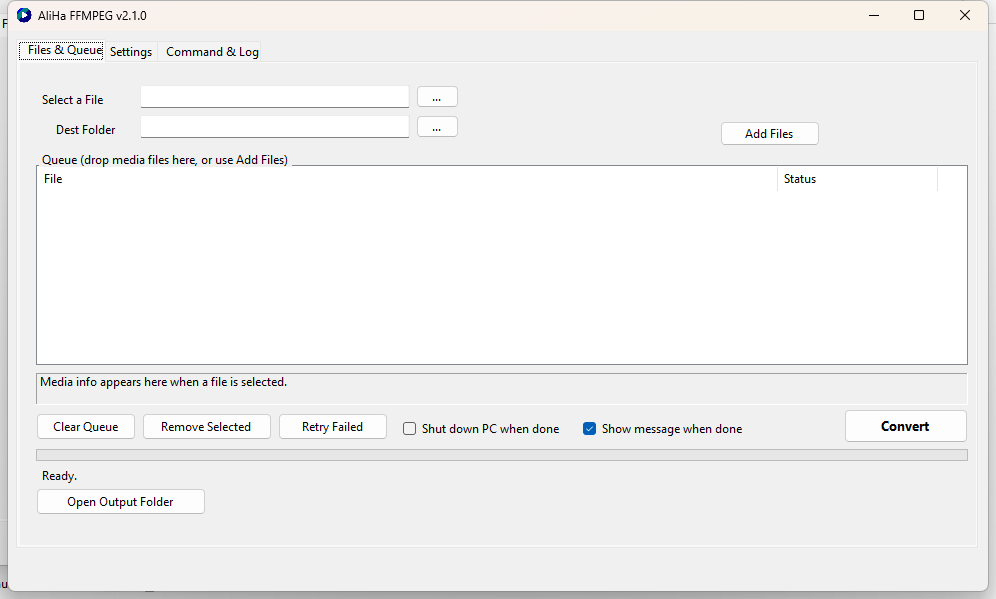
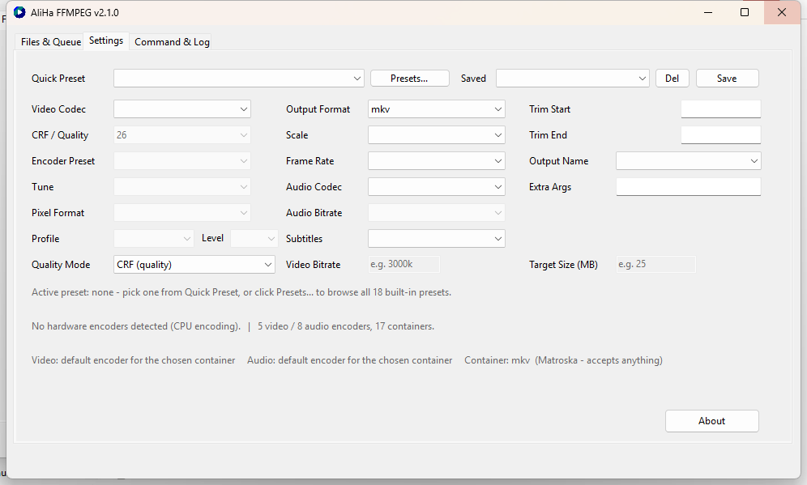
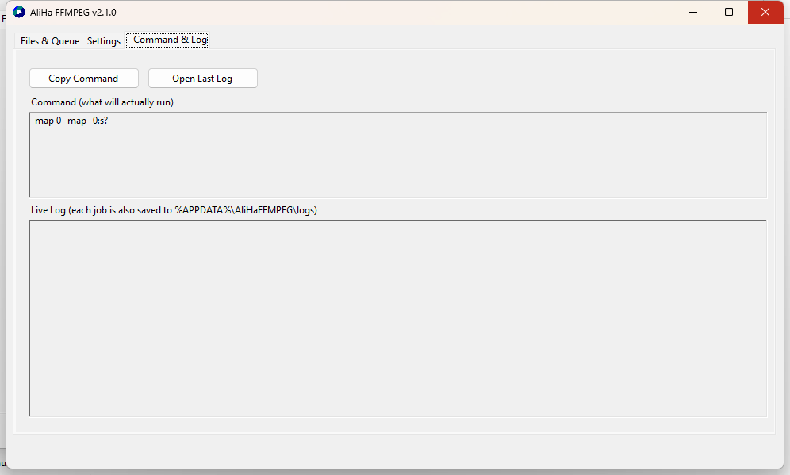

# AliHa FFMPEG

A friendly Windows GUI on top of **ffmpeg** for everyday media conversion — pick a file,
choose a preset, watch real progress with ETA. No command line required
(the full ffmpeg command is previewed live for those who want it).



## Features

- **Files & Queue tab** — select a single file, use **Add Files**, or **drag & drop**
  a whole folder of media; per-file status (Pending / Converting / Done / Failed),
  Retry Failed, Clear, Remove Selected
- **Live media info** — resolution, codecs, duration and bitrate via ffprobe
- **Real progress** — percent, speed and ETA from a machine-readable progress pipe
- **18 built-in one-click presets** (plus your own saved ones):
  Web/YouTube 1080p, Half the size (x265), Fit in 25 MB, Old TV / USB player (H.264 High@4.1),
  Discord / WhatsApp (small), Remux (copy), MP3 / M4A / WAV audio extract,
  Web 720p, Tiny e-mail file, x264 ultrafast, x265 archive, 10-bit HEVC,
  Vertical video (TikTok/Reels), Loudness fix (EBU R128), Deinterlace, Animated GIF
- **Settings tab** — video/audio codec, CRF, preset, tune, pixel format, profile/level,
  scale, frame rate, subtitle handling (copy/mov_text/drop), trim start/end, extra args
- **Hardware encoding** — NVENC / QSV / AMF are auto-detected and listed when present
- **Codec/container compatibility warnings** before a conversion starts
- **Quality modes** — CRF, fixed video bitrate, or target file size (MB)
- **Command & Log tab** — see exactly what ffmpeg runs, copy it, live log,
  per-job log files, open last log
- **Self-updating** — checks GitHub releases silently on startup, one-click
  download + install; can also **download an official ffmpeg build by itself**
- Options: notify when done, shut down PC when done, open output folder

## Screenshots

| Files & Queue | Settings | Command & Log |
|---|---|---|
|  |  |  |

> Screenshots were captured from a Debug build on a 150% display-scaled
> Windows 11 machine. Your layout may differ slightly with display scaling.

## Quick start

1. Download the newest `AliHaFFMPEG-win-x64.zip` from the
   [releases page](https://github.com/ali-hm/AliHaFFMPEG/releases) and extract it anywhere.
2. On first run, if `ffmpeg.exe` is missing next to the app, accept the offer to
   download an official Windows build (~85 MB) — or place your own
   `ffmpeg.exe` / `ffprobe.exe` beside `AliHaFFMPEG.exe`.
3. Pick a file (or drop in several), choose a preset, press **Convert**.

### Build from source

Requires the [.NET 10 SDK](https://dotnet.microsoft.com/download/dotnet/10.0).

```powershell
git clone https://github.com/ali-hm/AliHaFFMPEG.git
cd AliHaFFMPEG
dotnet build AliHaFFMPEG.sln
dotnet test AliHaFFMPEG.Core.Tests
dotnet run --project AliHaFFMPEG
```

The solution contains three projects:

| Project | What it is |
|---|---|
| `AliHaFFMPEG` | WinForms UI (thin view over Core) |
| `AliHaFFMPEG.Core` | Command builder, presets, progress parser, media info, updaters — no UI |
| `AliHaFFMPEG.Core.Tests` | 140+ xUnit tests for Core |

### Make a release

Two modes. In **both** you pass `-Version`; the script writes it into the csproj,
runs the tests, commits `Release vX.Y.Z`, tags it and creates the GitHub
Release. They differ only in **who builds the zip**.

**Mode 1 — Local** (zip built on this machine; needs [gh](https://cli.github.com)):

```powershell
pwsh ./scripts/release.ps1 -Mode Local -Version 2.2.0
```

1. Refuses a dirty working tree.
2. Writes `<Version>2.2.0</Version>` into `AliHaFFMPEG/AliHaFFMPEG.csproj`
   (single source of truth for the app version).
3. Runs the tests — a red build can never be released.
4. Commits the bump as `Release v2.2.0` and creates the annotated tag `v2.2.0`.
5. Builds + zips `release/AliHaFFMPEG-win-x64.zip`, writes
   `release/SHA256SUMS.txt`, and writes `release/RELEASE_NOTES.md` from the
   commit subjects since the previous tag (`scripts/Get-ReleaseNotes.ps1`).
6. Pushes the branch, then creates the GitHub Release and uploads the local
   zip + checksums. `gh` creates the remote tag at the release commit — no
   tag-push event, so CI does **not** build a second zip.

**Mode 2 — Remote** (the GitHub workflow builds the zip):

```powershell
pwsh ./scripts/release.ps1 -Mode Remote -Version 2.2.0
```

1–4. Same as Local.
5. Writes `release/RELEASE_NOTES.md` but does **not** build locally.
6. Pushes the branch **and the tag** — the tag push triggers the `release`
   workflow (`.github/workflows/release.yml`), which re-verifies the tag
   matches `<Version>`, builds, tests, zips and attaches the asset.
7. Also creates the GitHub Release itself (without assets) so the notes are
   deterministic; if the workflow created it first, the script just refreshes
   the notes. Without `gh` installed, it simply lets the workflow do it.

**Dry runs** — nothing pushed or published:

```powershell
pwsh ./scripts/release.ps1 -Mode Local -Version 2.2.0 -NoPush     # full local zip
pwsh ./scripts/release.ps1 -Mode Local -Version 2.2.0 -NoPush -SkipBuild   # reuse publish\
pwsh ./scripts/release.ps1 -Mode Remote -Version 2.2.0 -NoPush    # notes only
```

`-NoCommit` / `-NoTag` stop before the matching step in either mode.

No duplicate releases: Local never triggers CI (no tag push), and Remote's
workflow is idempotent — it updates the assets + notes if the release already
exists. The in-app "Check for updates" picks the release up from there.

Notes for both paths: the release zip contains **only** `AliHaFFMPEG.exe` (~45 MB,
no .NET install required) — ffmpeg is deliberately not bundled, see License below.

## How updates work

On startup the app quietly asks
`https://api.github.com/repos/ali-hm/AliHaFFMPEG/releases/latest` whether a
release is newer than the running version (`vX.Y.Z` tags, matching
`<Version>` in `AliHaFFMPEG.csproj`). If so, the About dialog can download the
`-win-x64.zip` asset and apply it without admin rights for a per-user install
(the updater script waits for the app to exit, copies files, restarts it).

You can point the app at a fork by setting `"UpdateRepository": "owner/repo"`
in `%APPDATA%\AliHaFFMPEG\settings.json`.

## License

- **AliHa FFMPEG itself is MIT licensed** — see [LICENSE](LICENSE). Do whatever
  you like with it; a credit is appreciated but not required.
- **ffmpeg/ffprobe are GPL-licensed.** We never bundle ffmpeg in this repo or
  in releases — the app downloads an official build at first run. That keeps
  the MIT application and the GPL tools as clearly separate programs.
